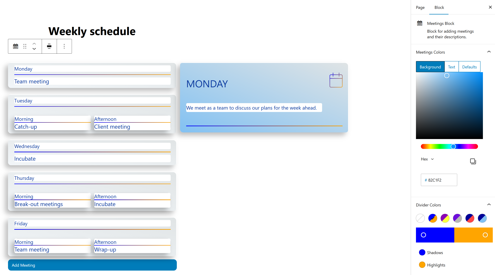

# WordPress Plugin

Gutenberg block built from scratch using React —  a structured content card block with expandable detail panels.

### Agenda Block
A structured content card block for presenting items with expandable detail. Cards can be split into sub-items, each generating its own description button automatically. Detail panel opens to the right on desktop and overlays on mobile. All layout logic is custom.

## Tech stack
- React / JavaScript
- PHP (WordPress admin-ajax.php proxy)
- WordPress / Gutenberg
- XAMPP / Apache (local development)

## Demo
[View on WordPress Playground](https://playground.wordpress.net) ← coming soon

## Architecture
Plugin avoids WordPress block data APIs in favour of custom implementations — the editor (`edit.js`) and frontend (`save.js`) interfaces are written directly for full control over both the authoring experience and rendered output.

## Running locally
1. Install [XAMPP](https://www.apachefriends.org)
2. Clone into your WordPress plugins directory:
```bash
git clone https://github.com/christopherdgibson/wp-agenda-block.git wp-content/plugins/gutenberg-blocks
```
3. Activate the plugin in WordPress admin
4. Add block via the Gutenberg editor

## Screenshots
# wp-agenda-block